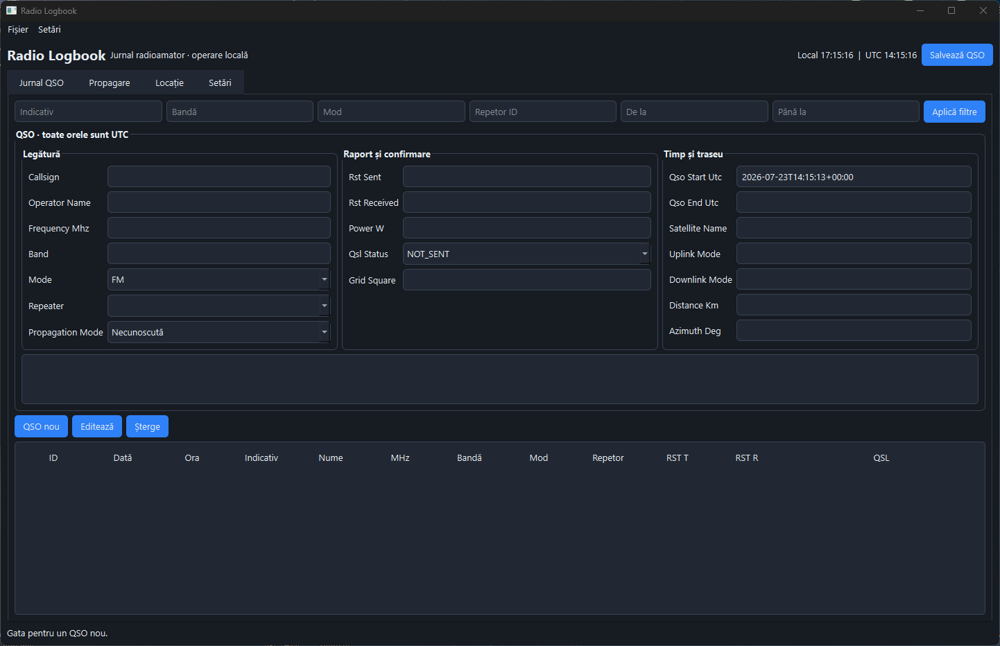

# Radio Logbook
<p align="center">
  
</p>
Aplicație desktop locală/offline pentru evidența legăturilor radioamatorice (QSO). Datele sunt păstrate în SQLite, iar Excel este utilizat numai pentru export.

## Funcționalități

- Adăugare, editare, ștergere, listare și filtrare QSO (indicativ, bandă, mod, repetor și interval UTC), cu confirmare înaintea ștergerii.
- Profil operator persistent în SQLite: date personale, echipament, antenă, putere implicită, club și observații.
- Validare indicativ, frecvență, putere, locator Maidenhead, date de propagare și interval temporal; avertizare pentru duplicate în ±2 minute.
- Calcul configurabil al benzii, repetoare administrabile și păstrarea QSO-urilor la ștergerea unui repetor (`repeater_id` devine `NULL`).
- Export Excel `.xlsx` cu antet, filtru, rând înghețat și dimensiuni ajustate; export ADIF cu lungimi calculate în octeți.
- Backup SQLite online în `backups/`, configurare JSON locală și jurnal în `radio_logbook.log`.

## Cerințe și instalare

Este necesar Python 3.11+ și o instalare Python care include PySide6 / Qt for Python.

```bash
python -m venv .venv
```

Windows:

```bash
.venv\Scripts\activate
```

Linux/macOS:

```bash
source .venv/bin/activate
```
Install requirements
```bash
pip install -r requirements.txt
```
Start
```bash
python main.py
```

La prima pornire se creează `data/logbook.db` și `config.json`. Datele personale ale operatorului sunt stocate separat, în tabelul SQLite `operator_profile`, astfel încât nu sunt pierdute la actualizările aplicației.

## Utilizare

Toate orele formularului și ale bazei de date sunt UTC; antetul afișează simultan timpul local și UTC. **QSO nou** sau `Ctrl+N` resetează formularul. `Ctrl+S` salvează, `Ctrl+F` deschide și focalizează căutarea, `Delete` șterge QSO-ul selectat după confirmare, iar `Escape` anulează editarea. Repetoarele pot completa frecvența, modul și banda, dar aceste valori rămân editabile.

În formularul QSO, bifează **Raport și confirmare** sau **Timp și traseu** pentru a afișa câmpurile din aceste secțiuni. Secțiunile sunt ascunse implicit, astfel încât interfața rămâne simplă când nu ai nevoie de ele.

### Meniul Fișier

Acțiunile care produc fișiere sunt grupate în **Fișier**: **Exportă Excel**, **Exportă ADIF** și **Creează backup**. Exporturile păstrează aceleași formate și alegerea destinației, iar backupul SQLite este creat în `backups/`. Comanda **Ieșire** închide în siguranță aplicația și ferestrele secundare deschise.

### Meniul Setări

**Setări → Date operator** deschide profilul operatorului, iar **Setări → Repetoare** deschide administrarea repetoarelor. Dacă una dintre aceste ferestre este deja deschisă, aplicația o aduce în față în loc să creeze un duplicat.

### Căutare și filtrare

Panoul de căutare și filtrare este ascuns la pornire pentru a păstra ecranul principal aerisit. Apasă **Caută / Filtrează** sau `Ctrl+F` pentru a-l afișa; butonul devine **Ascunde căutarea**. Ascunderea panoului nu șterge valorile și nu modifică rezultatele deja filtrate. Folosește numai **Resetează filtrele** pentru a elimina filtrele active.

### Profil operator și localizare Maidenhead

Deschide **Setări → Date operator** pentru a completa indicativul, numele, locatorul, localitatea, județul, țara, datele de contact, stația, antena, puterea implicită, clubul și observațiile. **Salvează** persistă profilul, iar **Resetează** îl golește numai după confirmare.

Formularul include și **Latitudine**, **Longitudine**, **Precizie localizare**, **Sursa localizării** și **Locator Maidenhead**. La apăsarea **Detectează locația**, aplicația încearcă mai întâi API-ul local Windows Location pe Windows (fără urmărire în fundal). Dacă acesta nu poate furniza o poziție sau pe altă platformă, încearcă explicit o estimare după adresa IP prin endpointul HTTPS configurabil `CALL_BOOK_LOCATION_ENDPOINT` (implicit `https://ipwho.is/`). Estimarea IP poate fi mai puțin precisă. Dacă locatorul salvat diferă, aplicația cere confirmare înainte de înlocuire. Poți introduce manual coordonatele pe orice platformă și apăsa **Recalculează locatorul**.

Coordonatele, sursa, precizia și momentul actualizării sunt păstrate numai local în SQLite, în profilul operatorului. Doar fallback-ul IP inițiat explicit prin buton contactează serviciul de geolocalizare și îi expune adresa IP; coordonatele rezultate nu sunt exportate ca latitudine/longitudine brută și nu sunt scrise în logurile tehnice. Locatorul operatorului este exportat ADIF ca `MY_GRIDSQUARE` (iar indicativul ca `STATION_CALLSIGN`); locatorul corespondentului rămâne `GRIDSQUARE`. QSO-urile noi rețin o copie a locatorului propriu pentru acuratețe istorică.

Pe laptopuri fără GPS, Windows poate estima poziția din Wi-Fi, rețea sau alte surse disponibile sistemului; precizia poate fi redusă. Pentru fallback-ul IP, aplicația verifică în worker DNS-ul și conectarea TCP la endpoint, apoi verifică TLS, codul HTTP, tipul de conținut și JSON-ul înainte de a actualiza formularul. Mesajele UI disting lipsa accesului la endpoint, DNS, timeout, TLS, HTTP și JSON invalid. Verificarea reală a Windows Location trebuie făcută pe un laptop Windows cu serviciile active; testele automate folosesc mock-uri și nu solicită poziția sistemului.

### Editarea și ștergerea QSO-urilor

Selectează un rând din tabel: devin disponibile **Editează** și **Șterge**. **Editează** încarcă toate datele și schimbă acțiunea principală în **Actualizează QSO**; ID-ul înregistrării rămâne același. **Anulează editarea** abandonează modificările fără a scrie în baza de date. **Șterge** afișează indicativul, frecvența și ora UTC a QSO-ului și solicită confirmare înainte de eliminarea definitivă.

### Formatare automată

Pe măsură ce tastezi, câmpul **Indicativ** este convertit în majuscule (inclusiv cifrele și `/`), iar spațiile exterioare sunt eliminate. Câmpul **Nume** capitalizează fiecare cuvânt și reduce spațiile multiple; cursorul este păstrat în poziția corespunzătoare în timpul formatării. La salvare, aceleași reguli sunt aplicate din nou ca validare finală.

Din **Fișier**, **Exportă Excel** creează implicit un fișier în `exports/`, **Exportă ADIF** creează `.adi` în același director, iar **Creează backup** folosește API-ul `sqlite3.backup()` și salvează în `backups/`.

Exportul ADIF include `PROP_MODE` când există echivalent ADIF, `SAT_NAME`, `SAT_MODE` (uplink/downlink), `DISTANCE` și observațiile de propagare în `COMMENT`, păstrând și observațiile QSO existente. Azimutul și modurile fără echivalent ADIF rămân disponibile în Excel. Exportul Excel adaugă coloanele **Propagare**, **Satelit**, **Uplink**, **Downlink**, **Distanță**, **Azimut** și **Observații propagare**.

## Structură

```text
main.py                 pornire
models.py               modele de date
database.py             acces SQLite parametrizat
validators.py           validare și benzi
utils/maidenhead.py     conversie locală coordonate/locator
services/location_service.py API Windows Location izolat de interfață
services/propagation_service.py reguli testabile pentru sugestia implicită de propagare
adif_export.py          export ADIF
excel_export.py         export Excel
backup.py               backup SQLite
config.py               configurare JSON
ui/                     interfața PySide6 / Qt for Python
tests/                  teste unittest
data/ exports/ backups/ date runtime
```

## Limitări și extensii

Interfața necesită un calculator cu server grafic pentru verificare vizuală. În medii headless se verifică importurile și logica independentă de UI, fără a porni o buclă PySide6 / Qt for Python persistentă. Nu sunt implementate QRZ, LoTW/eQSL, CAT, cloud, hărți, autentificare sau o aplicație web; modulele actuale permit adăugarea lor ulterioară fără a amesteca UI cu persistenta.

## Panou condiții de propagare

Fereastra principală conține un panou compact **Condiții de propagare**, nu o hartă. Fiecare valoare disponibilă arată unitatea, furnizorul și vechimea sa; o valoare fără observație verificabilă este **N/A**, niciodată zero. Modelul unificat reține valoarea, unitatea, sursa, momentul UTC, vechimea calculată, calitatea și starea. Tabelul HF calculează separat zi/noapte pentru 80, 40, 20, 15 și 10 m. Este o euristică locală, cu încredere scăzută/medie după acoperirea indicilor: **nu este VOACAP și nu este o predicție garantată**.

### Furnizori și produse

* **NOAA SWPC** — JSON HTTPS public: `planetary_k_index_1m.json` (Kp și A), `solar-cycle/observed-solar-cycle-indices.json` (F10.7 și SSN), produsele GOES X-ray/protoni/electroni, `rtsw_wind_1m.json` (viteză, densitate, temperatură), `rtsw_mag_1m.json` (Bz/Bt), OVATION (probabilitate aurorală) și alertele R. Sunt produse globale, în principal minute/oră sau cele mai recente valori disponibile; pot întârzia, pot lipsi și nu reprezintă măsurători locale.
* **SIDC/SILSO** — `https://www.sidc.be/SILSO/INFO/sndtotcsv.php`, CSV separat prin `;`, fără parametri. Se folosește ultimul *daily total sunspot number* valid (`count`), actualizat zilnic. Este preferat pentru SSN; nu este un flux în timp real.
* **GFZ Potsdam** — `https://kp.gfz-potsdam.de/app/files/Kp_ap_nowcast.txt`, text whitespace-delimited, fără parametri. Se citesc ultima pereche Kp/Ap nowcast validă (indici Kp și Ap, fără unitate fizică); cadența este de ordinul ferestrelor de 3 ore, iar valorile nowcast pot fi revizuite.

Nu există chei API hardcodate și nu se face scraping HTML. NOAA completează indici de vânt solar/GOES pe care ceilalți furnizori nu îi oferă; SILSO validează/completează SSN, iar GFZ validează/completează Kp și oferă Ap. Dacă un furnizor sau un produs individual răspunde cu timeout, 404, 429, eroare HTTP ori conținut neparsabil, celelalte produse continuă; 404 nu se reîncearcă, iar 429 are o singură reîncercare cu backoff. Panoul păstrează ultima citire validă dacă nu se poate obține nicio valoare nouă.

Datele agregate sunt păstrate local în `cache/space_weather/latest.json` timp de 15 minute. La schimbarea benzii actualizarea este debounced și rulează într-un fir separat; butonul **Actualizează** solicită date proaspete fără a recrea panoul. Actualizarea automată este activă implicit la 15 minute; în `config.json`, `propagation_auto_refresh_minutes` poate fi `10`, `15`, `30`, `60` sau altă valoare pentru dezactivare, iar `show_propagation_panel` controlează vizibilitatea.

Nu au fost introduse dependențe noi: clienții folosesc `urllib` din biblioteca standard. Furnizorii primesc numai cereri pentru date globale; nu se trimit indicativul, numele, adresa sau coordonatele utilizatorului.
