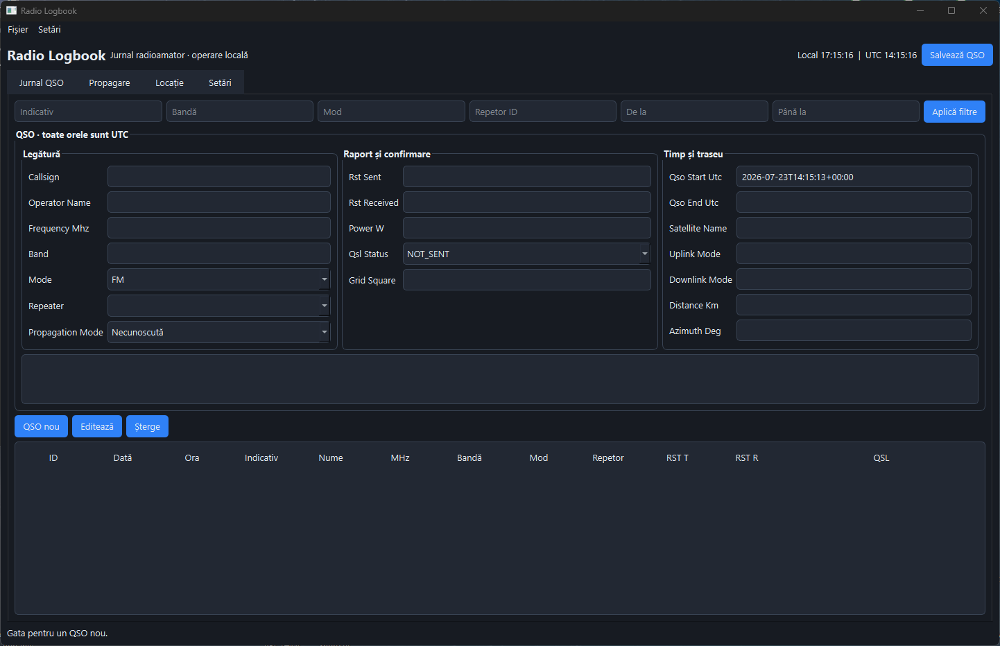

# Radio Logbook
<p align="center">
  
</p>

Aplicație desktop locală/offline pentru evidența legăturilor radioamatorice (QSO), scrisă în Python cu PySide6 (Qt for Python). Datele sunt păstrate în SQLite; Excel este folosit numai pentru export, nu ca sursă de date.

## Funcționalități

- **Jurnal QSO**: adăugare, editare, ștergere și listare a legăturilor, cu filtrare după indicativ, bandă, mod, ID repetor și interval de date.
- **Formular QSO inteligent**: formatare automată a indicativului și numelui pe măsură ce tastezi, detectare automată a benzii din frecvență, auto-completare frecvență/mod la alegerea unui repetor și **sugestie automată a modului de propagare** pe baza benzii/modului/repetorului selectat.
- **Detectare duplicate**: la salvare, aplicația avertizează dacă mai există un QSO cu același indicativ, frecvență și mod.
- **Repetoare administrabile**: listă proprie de repetoare (frecvențe, shift, CTCSS, locație), cu păstrarea QSO-urilor istorice la ștergerea unui repetor (`repeater_id` devine `NULL`).
- **Profil operator persistent** în SQLite (nu în `config.json`): date personale, echipament, antenă, putere implicită, club, observații și localizare (Maidenhead + coordonate).
- **Localizare automată**: detectare poziție prin Windows Location API (pe Windows) sau printr-un fallback HTTPS de geolocalizare IP, cu recalcularea locatorului Maidenhead.
- **Export Excel (`.xlsx`)** cu antet aldin, filtru automat, rând înghețat și lățimi de coloană ajustate.
- **Export ADIF** cu lungimi de câmp calculate exact în octeți (suport diacritice).
- **Backup SQLite online** (API `sqlite3.backup()`), fără să blocheze aplicația.
- **Panou „Condiții de propagare”**: indici meteo spațiali (Kp, SFI, SSN, raze X, vânt solar etc.) de la NOAA/SILSO/GFZ/NRCan/HamQSL și o estimare orientativă zi/noapte pentru benzile HF, cu actualizare automată configurabilă.
- **Vreme locală**: temperatură, umiditate și condiții curente la poziția stației (Open-Meteo, fără cheie API), afișate direct lângă formularul QSO.
- **Resetare numerotare ID-uri** pentru QSO-uri, repetoare și stații, fără pierderea datelor.

## Cerințe și instalare

Este necesar Python 3.11+ și o instalare Python care include PySide6 / Qt for Python.

```bash
python -m venv .venv
```

Windows:

```bash
.venv\Scripts\activate
```

Linux/macOS:

```bash
source .venv/bin/activate
```

Instalează dependențele:

```bash
python -m pip install -r requirements.txt
```

(Pentru dezvoltare — pachetul `call_book`, `ruff` și `mypy` — poți folosi alternativ `python -m pip install -e .`; `pyproject.toml` declară aceleași dependențe de rulare.)

La prima pornire se creează `data/logbook.db` și `config.json`. Datele personale ale operatorului sunt stocate separat, în tabelul SQLite `operator_profile`, astfel încât nu sunt pierdute la actualizările aplicației.

## Pornirea și actualizarea aplicației

Pornește întotdeauna aplicația prin lansator:

```bash
python launcher.py
```

Nu porni direct `python main.py`: `main.py` rămâne punctul de intrare PySide6, dar este pornit automat de lansator. La fiecare pornire, lansatorul verifică actualizările ramurii Git curente și aplică numai actualizări fast-forward. Dacă `requirements.txt` s-a schimbat, dependențele sunt instalate în același mediu Python.

Pentru actualizare automată, Git trebuie să fie instalat, iar proiectul trebuie obținut cu `git clone`, nu descărcat ca arhivă ZIP. Dacă nu există conexiune sau verificarea actualizărilor eșuează, aplicația pornește în continuare cu versiunea locală. Modificările locale nu sunt șterse, puse în stash sau suprascrise automat; o actualizare care nu poate fi aplicată fast-forward este anulată.

Pe Windows, `Launcher.bat` rulează `python launcher.py`.

## Fereastra principală

Antetul afișează titlul aplicației, locatorul stației (dacă e setat în profilul operatorului) și ceasul local + UTC, actualizat la fiecare secundă. Sub antet sunt file (tab-uri):

- **Jurnal QSO** — jurnalul propriu-zis: filtre, formular și tabelul de legături.
- **Propagare** — panoul de condiții de propagare (afișat doar dacă `show_propagation_panel` este activat în `config.json`; vezi [Panou condiții de propagare](#panou-condiții-de-propagare)).
- **Locație** — rezumatul poziției stației, cu acces rapid la profilul operatorului.
- **Setări** — aceleași acțiuni ca meniul **Setări**, disponibile și ca butoane.

### Jurnal QSO

**Formularul QSO** conține grupul **Legătură**: Indicativ, Nume, Repetor, Frecvență MHz, Bandă, Mod, Locator, Propagare, plus un câmp de **Observații**. Toate detaliile despre formatare, auto-completare și validare sunt în secțiunea [Formularul QSO](#formularul-qso). În dreapta formularului, panoul **Vreme locală** — vezi [Vreme locală](#vreme-locală).

**Acțiuni**: **Salvează QSO** (creează un QSO nou sau actualizează cel încărcat pentru editare — butonul nu își schimbă eticheta, comportamentul depinde de faptul că un QSO este sau nu încărcat), **QSO nou** (golește formularul; dacă erai în mijlocul unei editări, renunță la modificări fără să scrie în baza de date), **Editează** și **Șterge** (acționează asupra rândului selectat în tabel; dacă nu e nimic selectat, nu fac nimic). **Șterge** cere confirmare înainte de eliminarea definitivă.

**Căutare** — un buton comutabil lângă acțiuni; ascunde/arată rândul de filtre (**Indicativ**, **Bandă**, **Mod**, **Repetor ID**, **De la**, **Până la**) și butonul **Aplică filtre**, ascunse implicit. Nu există un buton de resetare — golește manual câmpurile dorite și aplică din nou. **De la**/**Până la** filtrează după data/ora la care a fost înregistrat QSO-ul.

**Tabelul de QSO-uri** are 11 coloane: ID, Ora locală, Dată UTC, Ora UTC, Indicativ, Nume, Grid Square, MHz, Bandă, Mod, Repetor, ordonate crescător după ID. Ora locală/UTC afișate provin din momentul la care a fost înregistrat QSO-ul.

Bara de stare de sub tabel arată numărul de QSO-uri afișate sau confirmarea ultimei acțiuni (export, backup, resetare ID-uri etc.).

### Locație

Afișează locatorul Maidenhead (sau cel implicit, dacă nu s-a completat unul propriu), latitudinea și longitudinea din profilul operatorului, plus un buton **Deschide profilul operatorului**.

### Setări

Oferă aceleași acțiuni ca meniul **Setări**, ca listă de butoane: Date operator, Administrează repetoare, Setări propagare, Setări vreme locală, Creează backup, Resetează numerotarea ID-urilor.

## Formularul QSO

### Câmpuri și tipul lor

| Câmp | Tip | Comportament |
|---|---|---|
| Indicativ | text | convertit automat în majuscule pe măsură ce tastezi (litere, cifre, `/`) |
| Nume | text | fiecare cuvânt e capitalizat automat, spațiile multiple sunt reduse |
| Repetor | listă needitabilă | se completează din repetoarele administrate; alegerea unuia auto-completează Frecvență și Mod |
| Frecvență MHz | text | la modificare, banda e detectată automat (dacă frecvența se încadrează într-o bandă cunoscută) |
| Bandă | text | completată automat din frecvență, dar rămâne editabilă manual |
| Mod | listă needitabilă | FM, AM, SSB, USB, LSB, CW, RTTY, FT8, FT4, PSK31, DIGITAL, MSK144, EchoLink, AllStar, DMR, D-STAR, C4FM, Internet Gateway |
| Locator | text | convertit automat în majuscule; validat ca locator Maidenhead valid (4/6/8 caractere) dacă e completat |
| Propagare | listă needitabilă | vezi [Sugestia automată de propagare](#sugestia-automată-de-propagare) mai jos |

Câmpurile **Repetor**, **Mod** și **Propagare** sunt combobox-uri needitabile identice ca stil și comportament: se deschid la orice click în casetă, afișează lista completă de valori și se închid la selecție — nu se poate introduce text liber în niciunul dintre ele.

### Sugestia automată de propagare

Câmpul **Propagare** primește o sugestie implicită de fiecare dată când se schimbă banda, modul sau repetorul selectat, pe baza unor reguli fixe (de exemplu F2 pentru 20–10m, NVIS pentru 80/60/40m, Sporadic-E pentru 6m, Repeater la alegerea unui repetor, EchoLink/AllStar/DMR/D-STAR/C4FM la modurile de rețea corespunzătoare, Meteor Scatter pentru MSK144 pe VHF).

O alegere manuală a utilizatorului este protejată: odată ce ai selectat manual un mod de propagare, schimbările ulterioare de bandă sau mod nu-l mai suprascriu automat — cu excepția selectării unui **repetor**, considerată un context suficient de semnificativ încât să suprascrie și o alegere manuală (regula acoperă și propagarea prin satelit, dar formularul actual nu are un control dedicat care să declanșeze acea sugestie automat; „Satelit” rămâne disponibil doar ca alegere manuală din listă). La încărcarea unui QSO existent pentru editare, valoarea salvată este tratată ca o alegere manuală (protejată). La **QSO nou**, valoarea de propagare a QSO-ului anterior este păstrată ca punct de plecare (operatorii loghează adesea mai multe legături consecutive pe același traseu de propagare), dar sugestia redevine activă pentru noua înregistrare.

### Validare la salvare

- Indicativul este obligatoriu și poate conține doar litere, cifre și `/`.
- Frecvența trebuie să fie un număr strict pozitiv.
- Modul este obligatoriu.
- Modul de propagare trebuie să fie una dintre valorile din listă.
- Locatorul Maidenhead, dacă e completat, trebuie să respecte formatul valid.
- Dacă un QSO cu același indicativ, frecvență și mod există deja, aplicația cere confirmare înainte de a salva un posibil duplicat.

Câmpul intern **locator propriu** (`my_grid_square`) este completat automat, la crearea unui QSO nou, cu locatorul curent din profilul operatorului, pentru acuratețe istorică — nu se schimbă retroactiv dacă profilul e actualizat ulterior.

### Vreme locală

Lângă formular, panoul **Vreme locală** afișează temperatura, umiditatea și condițiile curente la poziția stației (latitudine/longitudine din profilul operatorului), preluate de la [Open-Meteo](https://open-meteo.com/) — public, fără cheie API. Viteza vântului este observația METAR a Aeroportului Internațional Sibiu (LRSB), preluată de la Aviation Weather Center și afișată atât în noduri, cât și în km/h. Dacă observația METAR nu este disponibilă, vântul apare ca `N/A`, fără a ascunde celelalte date meteo. Panoul nu are un buton de actualizare manuală: se actualizează automat, o singură dată la scurt timp după deschiderea aplicației, apoi periodic la fiecare `local_weather_auto_refresh_minutes` (vezi [Setări vreme locală](#setări-vreme-locală)) minute. Dacă poziția stației nu e setată (Setări → Date operator), panoul arată acest lucru în loc să încerce o cerere fără sens. La fel ca panoul de propagare, orice eșec de rețea lasă ultimele valori afișate neschimbate, cu un mesaj de stare clar.

## Meniul Fișier

Acțiunile care produc fișiere sunt grupate în **Fișier**: **Exportă Excel**, **Exportă ADIF**, **Creează backup** și **Ieșire**.

### Export Excel

Fișierul `.xlsx` conține coloanele **ID, Callsign, Frequency MHz, Band, Mode, Repeater ID, Name, Grid, Propagare, Observații propagare, Notes**, cu antet aldin, primul rând înghețat, filtru automat pe toate coloanele și lățimi de coloană ajustate automat la conținut. Se salvează implicit în `exports/`.

### Export ADIF

Fiecare QSO devine o înregistrare ADIF cu lungimi de câmp calculate exact în octeți (corect pentru diacritice). Sunt incluse: `CALL`, `QSO_DATE`, `TIME_ON` (derivate din momentul înregistrării QSO-ului), `FREQ`, `BAND`, `MODE`, `NAME`, `GRIDSQUARE`, `COMMENT` (notele QSO-ului, cu observațiile de propagare adăugate dacă există), `MY_GRIDSQUARE` (locatorul propriu al QSO-ului sau, dacă lipsește, cel din profilul operatorului), `STATION_CALLSIGN` (indicativul din profilul operatorului) și `PROP_MODE` (când modul de propagare are un echivalent standard ADIF — de exemplu Satelit → `SAT`, F2 → `F2`, NVIS → `NVIS`). Se salvează implicit `.adi` în `exports/`.

### Backup

Folosește API-ul nativ `sqlite3.backup()` pentru o copie online, consistentă, a bazei de date, fără să blocheze aplicația. Fișierul rezultat e numit `logbook_AAAALLZZ_HHMMSS.db` și salvat în `backups/`.

## Meniul Setări

**Setări → Date operator**, **Setări → Repetoare**, **Setări → Setări propagare** și **Setări → Setări vreme locală** deschid ferestrele de mai jos ca dialoguri modale (cât timp sunt deschise, blochează interacțiunea cu fereastra principală — nu se pot deschide două ferestre de același tip simultan). **Setări → Resetează numerotarea ID-urilor** cere confirmare și resetează contoarele SQLite (`AUTOINCREMENT`) pentru QSO-uri, repetoare și stații, fără să șteargă vreo înregistrare; următorul ID va fi 1 dacă tabelul e gol sau va urma cel mai mare ID existent.

### Profil operator și localizare Maidenhead

Deschide **Setări → Date operator** pentru a completa indicativul, numele, locatorul, localitatea, județul, țara, datele de contact, echipamentul radio, antena, puterea implicită, clubul și observațiile. **Salvează** persistă profilul (indicativul și numele sunt normalizate — majuscule, respectiv fiecare cuvânt capitalizat), iar **Resetează** îl golește complet, numai după confirmare.

Formularul include și **Latitudine**, **Longitudine**, **Precizie localizare**, **Sursa localizării** și **Locator Maidenhead**. La apăsarea **Detectează locația**, aplicația încearcă mai întâi API-ul local Windows Location pe Windows (fără urmărire în fundal, într-un fir separat ca să nu blocheze interfața). Dacă acesta nu poate furniza o poziție sau pe altă platformă, încearcă explicit o estimare după adresa IP prin endpointul HTTPS configurabil `CALL_BOOK_LOCATION_ENDPOINT` (implicit `https://ipwho.is/`). Estimarea IP poate fi mai puțin precisă. Poți introduce manual coordonatele pe orice platformă și apăsa **Recalculează locatorul** pentru a obține locatorul Maidenhead corespunzător.

Coordonatele, sursa, precizia și momentul actualizării sunt păstrate numai local în SQLite, în profilul operatorului. Doar fallback-ul IP inițiat explicit prin buton contactează serviciul de geolocalizare și îi expune adresa IP; coordonatele rezultate nu sunt exportate ca latitudine/longitudine brută și nu sunt scrise în logurile tehnice. Locatorul operatorului este exportat ADIF ca `MY_GRIDSQUARE` (iar indicativul ca `STATION_CALLSIGN`); locatorul corespondentului rămâne `GRIDSQUARE`.

Pe laptopuri fără GPS, Windows poate estima poziția din Wi-Fi, rețea sau alte surse disponibile sistemului; precizia poate fi redusă. Pentru fallback-ul IP, aplicația verifică DNS-ul și conectarea TCP la endpoint, apoi verifică TLS, codul HTTP, tipul de conținut și JSON-ul înainte de a actualiza formularul. Mesajele UI disting lipsa accesului la endpoint, DNS, timeout, TLS, HTTP și JSON invalid. Verificarea reală a Windows Location trebuie făcută pe un laptop Windows cu serviciile active; testele automate folosesc mock-uri și nu solicită poziția sistemului.

### Administrare repetoare

**Setări → Repetoare** deschide un dialog cu formular (Nume, Frecvență ieșire, Frecvență intrare, Shift, CTCSS, Mod, Locație, Locator, Observații) și un tabel cu repetoarele existente. **Nume** și **Frecvență ieșire (MHz)** sunt obligatorii; lipsa lor afișează o eroare și nu salvează nimic. **Salvează** creează un repetor nou sau îl actualizează pe cel selectat din tabel; **Nou** golește formularul și selecția; **Șterge** cere confirmare și elimină repetorul, păstrând QSO-urile istorice care îl referă (`repeater_id` devine `NULL` pentru acestea). Orice modificare reîmprospătează imediat lista de repetoare din formularul QSO.

### Setări propagare

**Setări → Setări propagare** conține o bifă **Actualizare automată** și un interval configurabil (10, 15, 30 sau 60 de minute), salvate în `config.json` ca `propagation_auto_refresh_minutes`. **Salvează** persistă valoarea și reprogramează imediat actualizarea automată a panoului de propagare (vezi mai jos). Dezactivarea bifei salvează intervalul ca `"0"`, ceea ce oprește actualizarea automată complet.

### Setări vreme locală

**Setări → Setări vreme locală** funcționează identic cu Setări propagare: o bifă **Actualizare automată** și un interval configurabil (10, 15, 30 sau 60 de minute), salvate în `config.json` ca `local_weather_auto_refresh_minutes` (implicit 30). **Salvează** reprogramează imediat actualizarea automată a panoului **Vreme locală**; dezactivarea bifei salvează `"0"`, oprind actualizarea automată complet. Panoul de vreme locală nu are un buton de actualizare manuală — aceasta este singura cale de a-i schimba cadența.

## Panou condiții de propagare

Fereastra principală poate conține un panou compact **Condiții de propagare**, nu o hartă — vizibil doar dacă `show_propagation_panel` din `config.json` este `"true"` (implicit). Fiecare valoare disponibilă arată unitatea, furnizorul și vechimea sa; o valoare fără observație verificabilă este **N/A**, niciodată zero. Modelul unificat reține valoarea, unitatea, sursa, momentul UTC, vechimea calculată, calitatea și starea. Tabelul HF calculează separat zi/noapte pentru 80, 40, 20, 15 și 10 m. Este o euristică locală, cu încredere scăzută/medie după acoperirea indicilor: **nu este VOACAP și nu este o predicție garantată**.

Actualizarea se produce în trei situații: la apăsarea butonului **Actualizează**, automat (cu întârziere de 700 ms) când banda din formularul QSO se schimbă, și periodic — dacă panoul e activat, la fiecare `propagation_auto_refresh_minutes` (10/15/30/60) minute, doar dacă o bandă e curentă selectată în formular. Actualizarea din fundal se oprește automat la închiderea aplicației. Toate cererile HTTP rulează într-un fir separat, ca să nu blocheze interfața.

### Furnizori și produse

* **NOAA SWPC** — JSON HTTPS public: `planetary_k_index_1m.json` (Kp și A), `solar-cycle/observed-solar-cycle-indices.json` (F10.7 și SSN), produsele GOES X-ray/protoni/electroni, fluxul `plasma-7-day.json` pentru viteza vântului solar și `mag-7-day.json` pentru Bz, și alertele R. Sunt produse globale, în principal minute/oră sau cele mai recente valori disponibile; pot întârzia, pot lipsi și nu reprezintă măsurători locale.
* **SIDC/SILSO** — `https://www.sidc.be/SILSO/INFO/sndtotcsv.php`, CSV separat prin `;`, fără parametri. Se folosește ultimul *daily total sunspot number* valid (`count`), actualizat zilnic. Este preferat pentru SSN; nu este un flux în timp real.
* **GFZ Potsdam** — `https://kp.gfz-potsdam.de/app/files/Kp_ap_nowcast.txt`, text whitespace-delimited, fără parametri. Se citesc ultima pereche Kp/Ap nowcast validă (indici Kp și Ap, fără unitate fizică, ignorând rândurile cu sentinela de date lipsă Kp=-1.000/ap=-1); cadența este de ordinul ferestrelor de 3 ore, iar valorile nowcast pot fi revizuite. Este preferat pentru Kp/Ap.
* **NRCan (Space Weather Canada)** — `https://spaceweather.gc.ca/solar_flux_data/daily_flux_values/fluxtable.txt`, text whitespace-delimited, fără parametri. Se folosește ultima valoare *fluxadjflux* (F10.7 corectat la 1 UA) validă. Este preferat pentru SFI.
* **HamQSL (N0NBH)** — `https://www.hamqsl.com/solarxml.php`, XML public actualizat orar, gândit pentru software de radioamatorism. Completează A index, X-ray (convertit din notația pe clase NOAA, ex. `M1.8` → W/m²), flux de protoni/electroni, viteza vântului solar și Bz — metrici pentru care NOAA era altfel singura sursă. Doar completează valorile pe care NOAA nu le-a putut furniza, nu le suprascrie pe cele reușite (spre deosebire de SILSO/GFZ/NRCan, care sunt agenții oficiale de măsurare și au prioritate față de copia NOAA). Câmpul `aurora` din acest flux e un indice de activitate 1–10 fără o unitate comparabilă cu restul metricilor afișate, așa că nu este citit.

Nu există chei API hardcodate și nu se face scraping HTML. NOAA completează indici de vânt solar/GOES pe care ceilalți furnizori nu îi oferă; SILSO validează/completează SSN, GFZ validează/completează Kp și oferă Ap, NRCan validează/completează SFI, iar HamQSL umple golurile rămase când NOAA e indisponibil. Dacă un furnizor sau un produs individual răspunde cu timeout, eroare HTTP ori conținut neparsabil, celelalte produse continuă — fiecare cerere are o singură reîncercare cu backoff scurt înainte să fie considerată eșuată. Panoul păstrează ultima citire validă dacă nu se poate obține nicio valoare nouă.

Activitatea aurorală, Bt și densitatea/temperatura vântului solar nu sunt urmărite: nu intră în calculul estimărilor de bandă din tabelul HF, iar pentru ele nu există o sursă publică la fel de simplă și verificabilă ca restul furnizorilor de mai sus.

NOAA SWPC este protejat de o verificare anti-bot (AWS WAF) care respinge clienții HTTP obișnuiți, indiferent de header-e, cu un răspuns gol — un browser real trece, `curl` sau Python simplu nu. Clienții acestui modul folosesc [`curl_cffi`](https://github.com/lexiforest/curl_cffi) cu `impersonate="chrome"`, care reproduce amprenta TLS/HTTP2 a lui Chrome, pentru a trece de această verificare; nu e o garanție universală, doar cel mai bun răspuns disponibil fără un browser real cu JavaScript.

Datele agregate sunt păstrate local în `cache/space_weather/latest.json` timp de 15 minute — o cerere de reîmprospătare în această fereastră reutilizează cache-ul în loc să facă cereri HTTP noi. Furnizorii primesc numai cereri pentru date globale; nu se trimit indicativul, numele, adresa sau coordonatele utilizatorului.

## Configurare (`config.json`)

Fișierul e creat automat la prima pornire, cu chei implicite. Doar trei chei au efect asupra aplicației în acest moment:

| Cheie | Valori | Efect |
|---|---|---|
| `show_propagation_panel` | `"true"` / `"false"` | dacă tab-ul **Propagare** și panoul asociat sunt create la pornire |
| `propagation_auto_refresh_minutes` | `"10"`, `"15"`, `"30"`, `"60"` (orice altă valoare dezactivează) | intervalul actualizării automate a panoului de propagare |
| `local_weather_auto_refresh_minutes` | `"10"`, `"15"`, `"30"`, `"60"` (orice altă valoare dezactivează) | intervalul actualizării automate a panoului de vreme locală |

Fișierul mai reține și câteva chei suplimentare (`user_callsign`, `operator_name`, `grid_square`, `location`, `equipment`, `antenna`, `default_power_w`, `export_directory`, `backup_directory`) care nu sunt citite momentan de aplicație — datele reale ale operatorului sunt stocate în tabelul SQLite `operator_profile`, iar exporturile/backup-ul folosesc directoarele implicite `exports/`/`backups/`.

## Date runtime și loguri

- `data/logbook.db` — baza de date SQLite (QSO-uri, repetoare, stații, profil operator).
- `exports/` — fișierele `.xlsx`/`.adi` generate.
- `backups/` — copiile de siguranță `.db`.
- `cache/space_weather/latest.json` — cache local pentru datele de propagare (valabil 15 minute).
- `config.json` — configurația locală descrisă mai sus.
- `radio_logbook.log` — jurnal tehnic al aplicației (nivel `DEBUG`).

Niciunul dintre acestea nu e urcat în Git (vezi `.gitignore`).

## Structură

```text
launcher.py                          pornire și actualizare automată sigură
main.py                              punct de intrare PySide6, pornit de launcher
pyproject.toml                       pachet, configurare ruff și mypy
requirements.txt                     dependențe de rulare (folosit și de launcher.py)
.github/workflows/ci.yml             CI: ruff, mypy și teste, headless
call_book/                           pachetul aplicației
  models.py                          modele de date (QSO, Repeater, OperatorProfile), QSO.from_row()
  database.py                        acces SQLite parametrizat
  validators.py                      validare și benzi
  application_controller.py          cazuri de utilizare independente de UI (LogbookController)
  adif_export.py                     export ADIF
  excel_export.py                    export Excel
  backup.py                          backup SQLite online
  config.py                          configurare JSON
  propagation.py                     vocabular de propagare și mapare ADIF
  propagation_models.py              modele imuabile pentru date meteo spațiale
  utils/maidenhead.py                conversie locală coordonate/locator
  utils/text_formatters.py           formatare indicativ/locator/nume în timp real
  services/band_detector.py          conversie frecvență → bandă pentru UI
  services/location_service.py       API Windows Location + fallback IP, izolat de interfață
  services/propagation_service.py    reguli testabile pentru sugestia automată de propagare
  services/propagation_estimator.py  estimare orientativă zi/noapte pentru benzile HF
  services/propagation_cache.py      cache local pentru datele meteo spațiale
  services/space_weather_service.py  clienți NOAA/SILSO/GFZ/NRCan/HamQSL
  services/local_weather_service.py  client Open-Meteo pentru vremea locală
  ui/                                 interfața PySide6 / Qt for Python
tests/                                teste unittest (vezi mai jos)
data/ exports/ backups/ cache/        date runtime (negestionate în Git)
```

## Testare și integrare continuă

Suita de teste acoperă logica independentă de UI (validare, export, bază de date, servicii) și, unde PySide6 poate rula headless, comportamentul formularelor Qt (formatare, sugestie de propagare, dialoguri de validare). Rulează local:

```bash
QT_QPA_PLATFORM=offscreen python -m unittest discover -s tests -v
```

`.github/workflows/ci.yml` rulează la fiecare push/PR pe `main`: instalează bibliotecile de sistem Qt necesare pentru modul headless (`libegl1`, `libgl1`, etc.), apoi `ruff check`, `ruff format --check`, `mypy` și suita completă de teste, tot cu `QT_QPA_PLATFORM=offscreen`.

## Limitări și extensii

Verificarea vizuală completă a interfeței necesită un calculator cu server grafic sau, ca alternativă headless, bibliotecile de sistem Qt (`libegl1`/`libgl1` etc.) plus `QT_QPA_PLATFORM=offscreen` — configurația folosită și de CI. Nu sunt implementate QRZ, LoTW/eQSL, CAT, cloud, hărți, autentificare sau o aplicație web; modulele actuale permit adăugarea lor ulterioară fără a amesteca UI cu persistența.
